<h1 align="center">Welcome to MrXunUniApp 👋</h1>

  
  
  
  
  

> uniapp+unicloud+colorui+uview

## Prerequisites

- npm >=5.5.0
- node >=9.3.0

## Author

👤 **Mr-xun**

* Github: [@Mr-xun](https://github.com/Mr-xun)

## Show your support

Give a ⭐️ if this project helped you!

***
_This README was generated with ❤️ by [readme-md-generator](https://github.com/kefranabg/readme-md-generator)_

#### Show Pages

  
  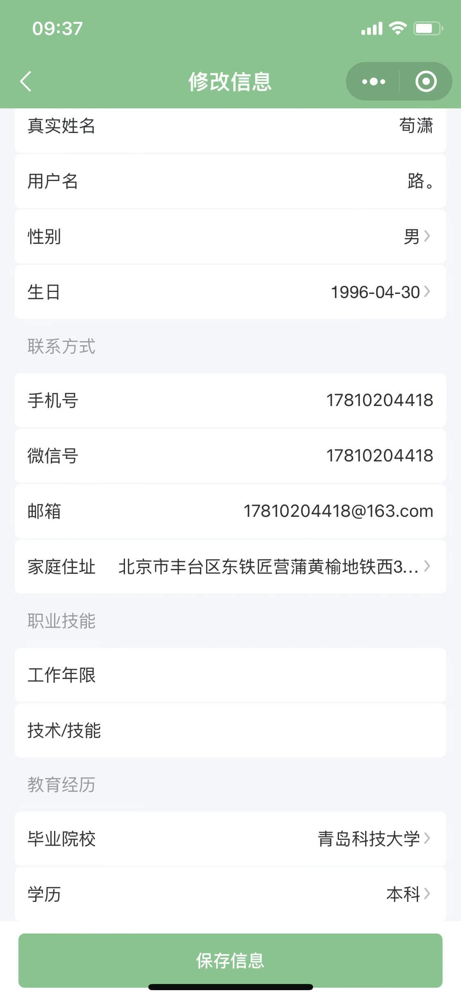
  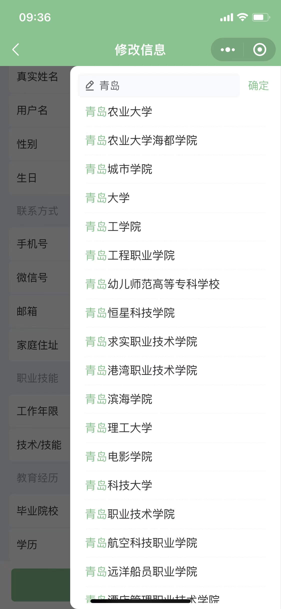
  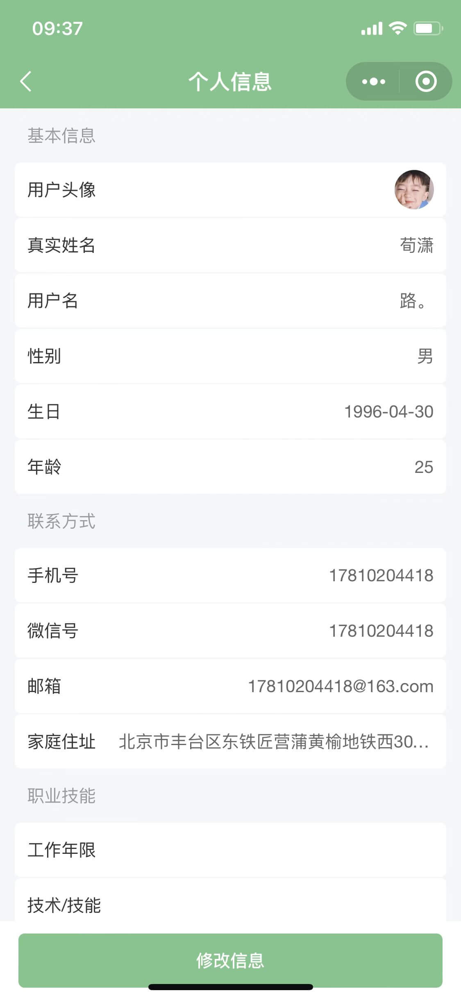
  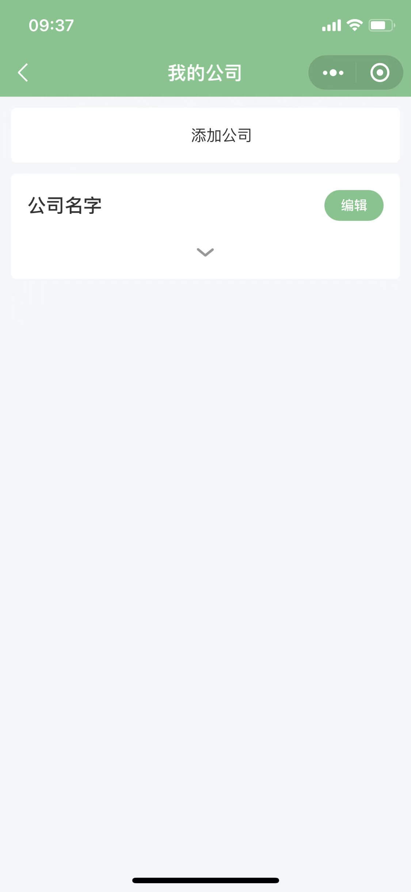
  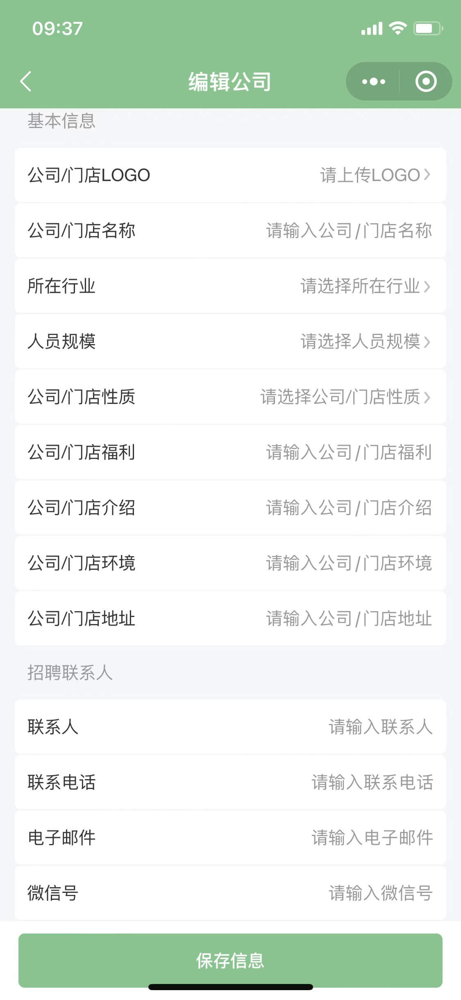
  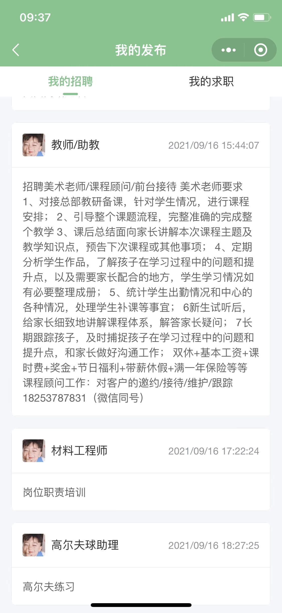
  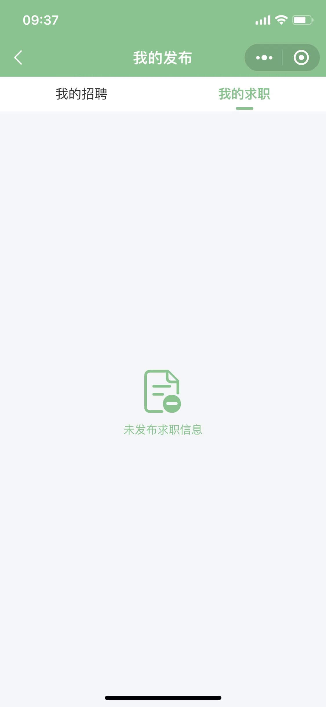
  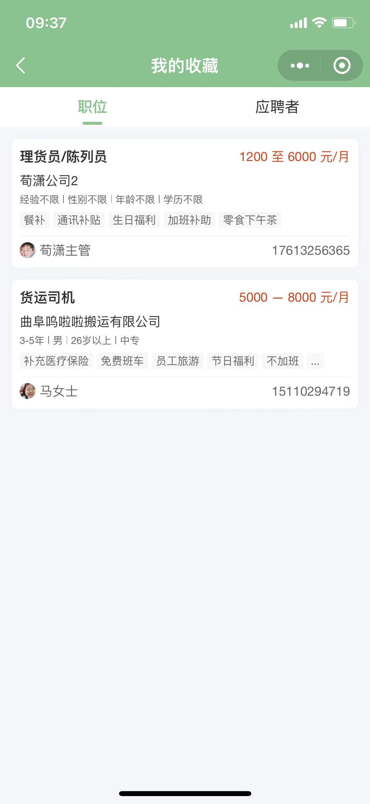
  
  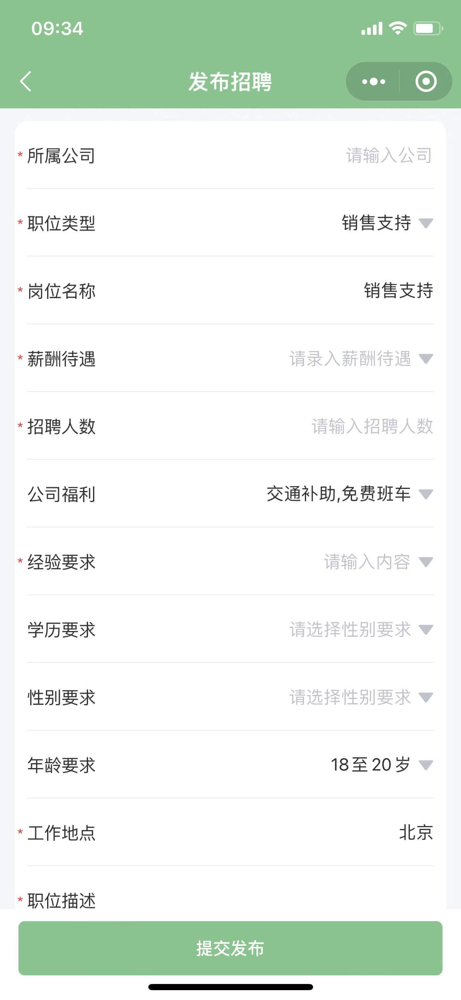
  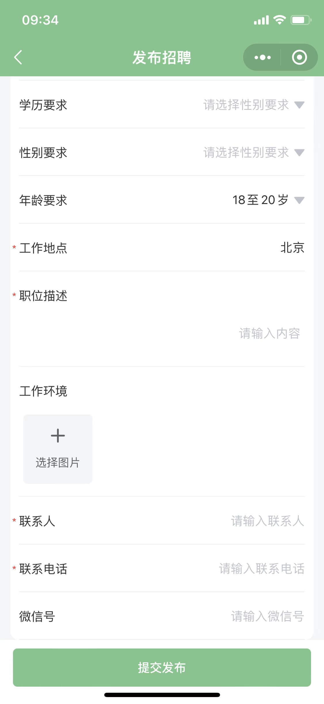
  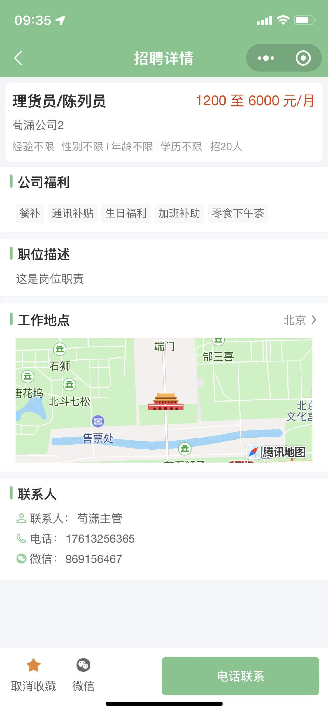
  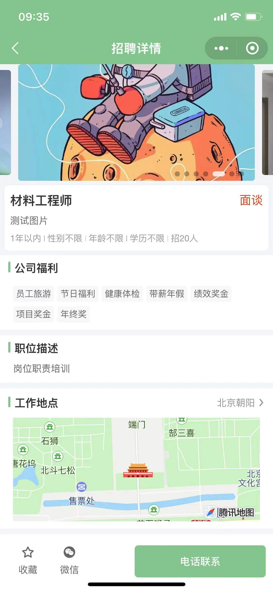
  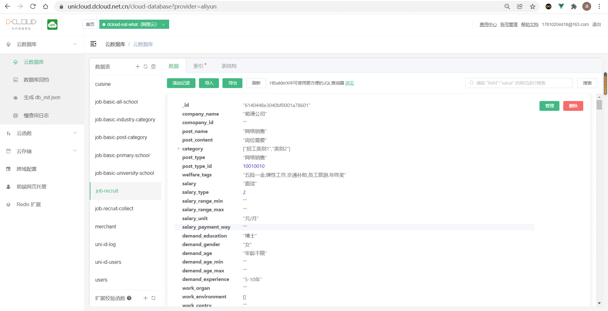
  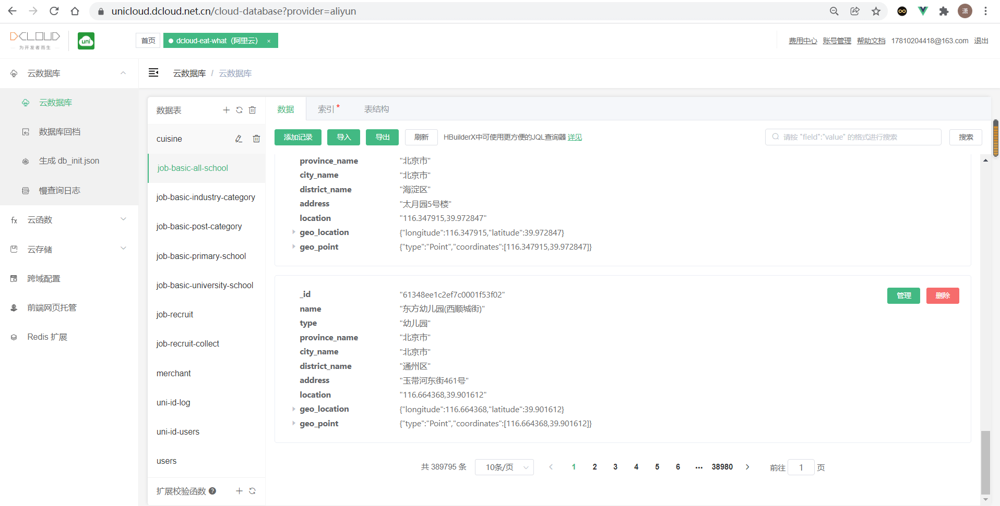